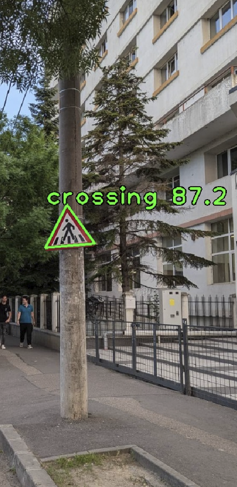
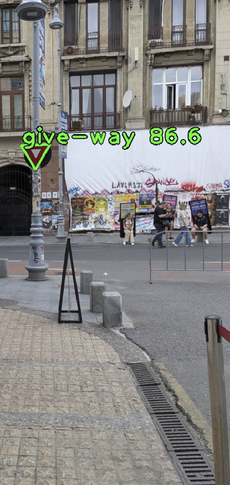
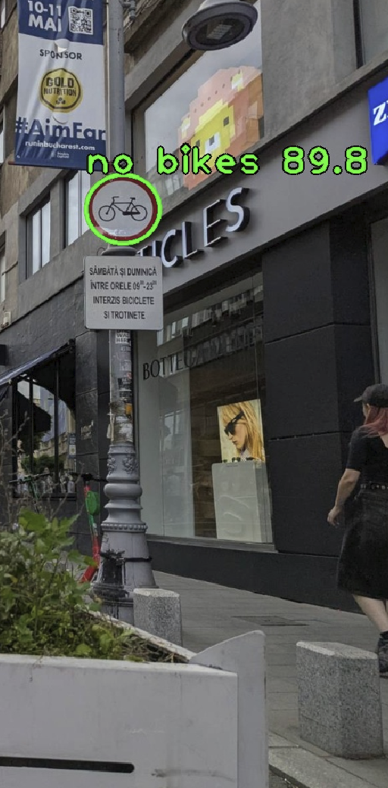
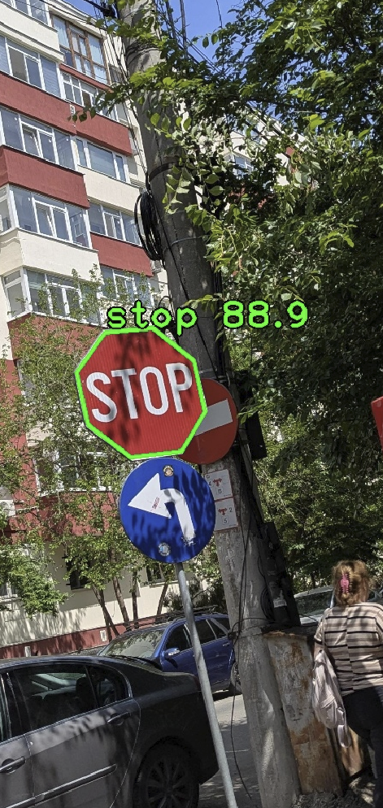
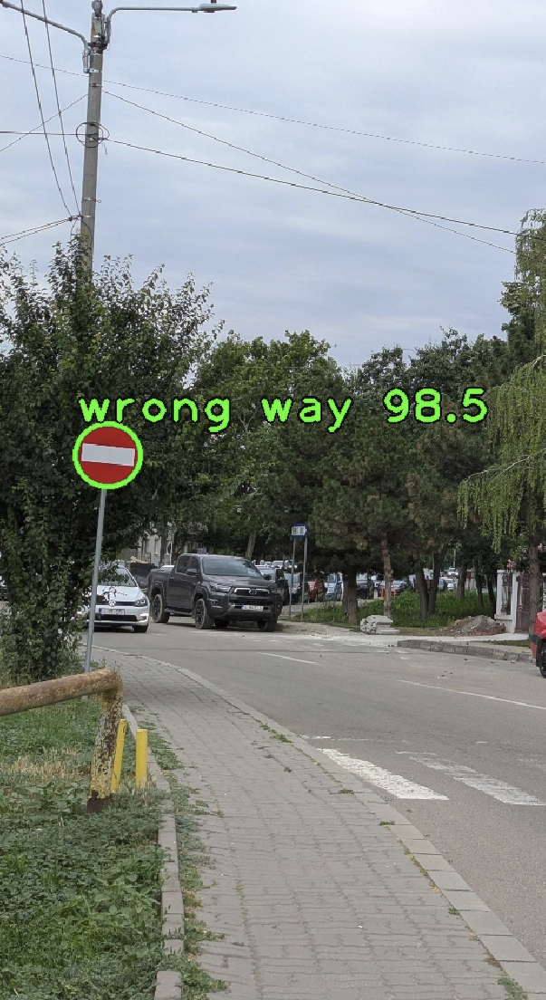

# Bike System
This repo tracks my progress developing a three-module bike system for my Elops Speed 500 bike from Decathlon. It is able to warn the cyclist in real time of 5 important traffic signs using the bike camera module, display real time movement metrics using the magnetic sensor on the wheel via the bike calculator module and a third component can analyse data stored on a microSD by plotting graphs enabled by a python 3 script.    

	

## The Bike Camera
The Bike Camera is able to detect 5 important street signs in real time: Pedestrian crossing, Give way, No bikes, Stop and Wrong way.

  
  &nbsp;&nbsp;&nbsp;&nbsp;&nbsp;
  
  &nbsp;&nbsp;&nbsp;&nbsp;&nbsp;
  
  &nbsp;&nbsp;&nbsp;&nbsp;&nbsp;
  
  &nbsp;&nbsp;&nbsp;&nbsp;&nbsp;
  

The detections happen in real time, about 5 photos are taken and processed every second. 

### Sign Detection and Behaviour analiysis
Detect street signs in real time and store the moment of detection in a csv file. Look at the velocity evolution after seeing key street signs and observe behaviour. This part is a mix between the real time calculator and the data analisys. 

#### Main goal
* mount camera to current case (make an attachment?)
* detect important street signs in real time
* store the moment of detection, how well it maches and the type of sign
* warn the rider if necessary
* observe how speed evolves after sign detection. Does the rider react in any way?

## Inspiration
This project is mandated by my university as I'm a third year student in an engineering degree. It is also an homage to the thing that got me into arduino and therefore microcontroller programming in the first place: bike-calc, the bike calculator that did indeed turn into a basic prototype but ended up being scrapped. It was my first project and needed a major redesign to meet my current standards, therefore this is bike-calc 2.0, or rather bike-system.  

# Development Information

## E-Ink display

### Documentation Link:
https://files.waveshare.com/upload/e/e5/1.54inch_e-paper_V2_Datasheet.pdf

### Screen Requirements:
* full refresh every 180 s
* keep white while not in use
* operating temperatures: 0 - 50 C
* storing temperatures: -25 - 50 C

## Advice for the project

### Advice for the camera and sign detection
as putea sa am un flag in care ma uit daca am ceva rosu care vine inspre mine, sau un marker ca ar putea exista un semn de interes in poza si abia atunci sa incerc sa fac detectia

tabel cu ce optiuni sunt, cat de bine se descurca

esp camera
	posibil underpowered
	ar putea fi good enough

arduino camera
	https://store.arduino.cc/products/nicla-vision

raspberry pi zero camera
	camera mai buna si mai puternica

golden standard
	opencv oak one camera

### Project presentation advice

intro -> show a picture of the project
project overview 
where did everyghing start, motivation
my contribution, did I come up with something new 
what would i change, what i don't like about the project
what would i add, would i like to continue developing the projcet?
numerotare slideuri
last slide -> a short summary, something to stick to the viewer

### Plans for near future

* design PCB
* order from jlcpcb 
* order ESP32-cam and lead free solder
* put together a pcb and working calculator
* put together sign detection module 
* link them up using battery
* establish comms using serial or esp-now for less battery
