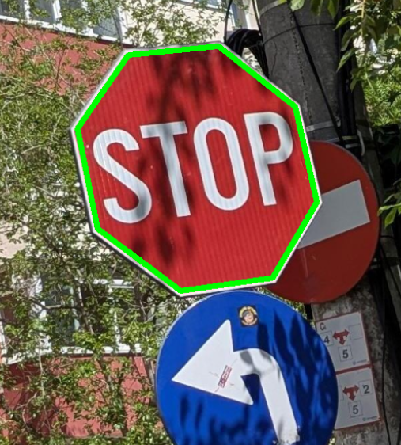
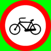
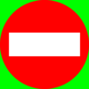

# Bike System
This repo tracks my progress developing a three-module bike system for my Elops Speed 500 bike from Decathlon, but it was designed to be easily adapted to any other bike. It is able to warn the cyclist in real time of 5 important traffic signs using the bike camera module, display real time movement metrics using the magnetic sensor on the wheel via the bike calculator module and a third component can analyse data stored on a microSD by plotting graphs enabled by a Python3 script.

You can find the original thesis, presentation and final grade in the "./documents/thesis-presentation" directory and <a href="https://docs.google.com/presentation/d/1_chzi4_kqwfPNCdIw6u2Pty6pEz1_2fhgnUXKMC94gg/edit?usp=sharing"><u><b>here</b></u></a> is a link to the final presentation translated in english. 

This is how the project looks attached to the bike and in use, with and without the road sign detection camera:

	
	

Below is a diagram with the main high level components of the project, as well as the relationship between them.

	

## The Bike Camera
The bike camera is able to detect 5 important street signs in real time: Presignaling pedestrian crossing, Give way, No entry for bicycles, Stop and No entry. The detections happen in real time: about 5 photos can be taken and processed every second.

The main purpose for it is to provide an example of possible modular components within this system, where hardware can be added or removed whether necessary or not, in order to achieve a more compact form factor. The complexity of this component highlights the countless possibilities of what add-ons can bring.

  
  &nbsp;&nbsp;
  
  &nbsp;&nbsp;
  
  &nbsp;&nbsp;
  
  &nbsp;&nbsp;
  

 

 <B>How signs are detected</B> 

The main approach for detecting road signs involves finding regions of interest (ROI) upon which a template matching algorithm can be applied to check for the 5 road signs mentioned above.
  
Because it is expensive to check the color of each individual pixel, binary masks are generated for each picture in order to leverage the power of OpenCV functions, which are heavily optimised. The masks indicate the presence of the 4 main colors used in the sought after signs. Those colors are: bright red, dark red, white and black.
   

  
  &nbsp;&nbsp;
  

	
  
  &nbsp;&nbsp;
  

After that, all connex components in the red mask are determined and key corners speciffic to the shape of the sought street signs are identified. Angles between said corners are computed in order to determine if they could form a valid road sign shape. 

If so, a bounding box fitting the sign is computed and a perspective transform is done, fitting perfectly the potential road sign over the respective template. A pixel by pixel comparison between the transformed generated masks and the template determines the cirtenty of the match, which then has the potential to lead to a recognition.

 

  
  &nbsp;&nbsp;
  

	
  
  &nbsp;&nbsp;
  

 

The templates used contain the pure RGB colors for red (255, 0, 0), white (255, 255, 255) and black (0, 0, 0) for each sign, as well as green (0, 255, 0) for the background. This is so that if there is too much red belonging to the connex component of the detected sign in the green area, the detection is discarded.

 

  
  &nbsp;&nbsp;
  
  &nbsp;&nbsp;
  
  &nbsp;&nbsp;
  

 
<!-- todo add rotation of no bikes-->

 

 <B>Hardware</B> 

The main hardware components include:
  * Raspberry Pi Zero 2 W development board - ARM Cortex-A53 (MPU)
  * Camera 3 module for Raspberry Pi 12MP
  * LiPo battery, 3.7V, 2500mAh with integrated protections
  * Step-up convertor, 5V Pololu S13V15F5
  * TP4056 Charging Module 

Below are all the components assembled in a half printed case. 

  

 
The 3D printed case is made so that it can be mounted to the Bike calculator, which is the main component of the project. 

The two modules communicate using UART via a 3 pin connector, for RX, TX and GND.

